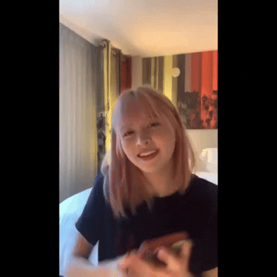
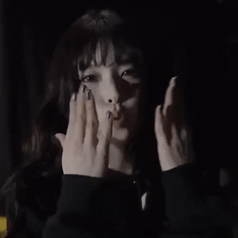

<!DOCTYPE html>
<html>
<head>
<title> 有些話要跟你說~</title>

</head>
</head>

<body>
<h1>🤍</h1>

想跟你說... 

<!-- GIF -->
  
  
  
  

    

      謝謝你 讓我知道什麼叫穩定直接的愛
      

    

     也讓我看見、學到許多不一樣的事物
    

 

     跟你在一起的每個時光我都很開心
    
    
       

     不管是吃飯、聊天、追劇或是廢在家裡
    

     

     很喜歡這種一起的感覺🫶
    

    
 雖然有時候我會有小情緒然後找你講一些話
    

    
或是突然問你一些可能很莫名其妙的問題

      
我知道我還在學習找到安全感和自信

       
也還在慢慢學習變得更好

    

    謝謝你都很耐心的聽我說 也願意包容我

    

     總是給我建議或是跟我討論引導我找到原因

     
然後可能我的表達能力不是那麼的好

     
在你沮喪或壓力大時

    

      可能沒辦法給出你想要的答案也不一定能幫你解決到問題

     
但我想跟你說

     
我會陪著你的！跟你一起面對！

    
可能你會覺得3個月沒什麼好紀念的

    
但我就想寫個東西給你🙂‍↕️

    
你給了我很多很多的愛

    
所以我也要給你很多很多的愛

     
而且Lily 也說過 愛就要大聲說
   
    
I wanna love you loud❤️

    
我愛你🫶🫶🫶 muah!💋

    
<!-- GIF -->
  

  

</body>

</html>
